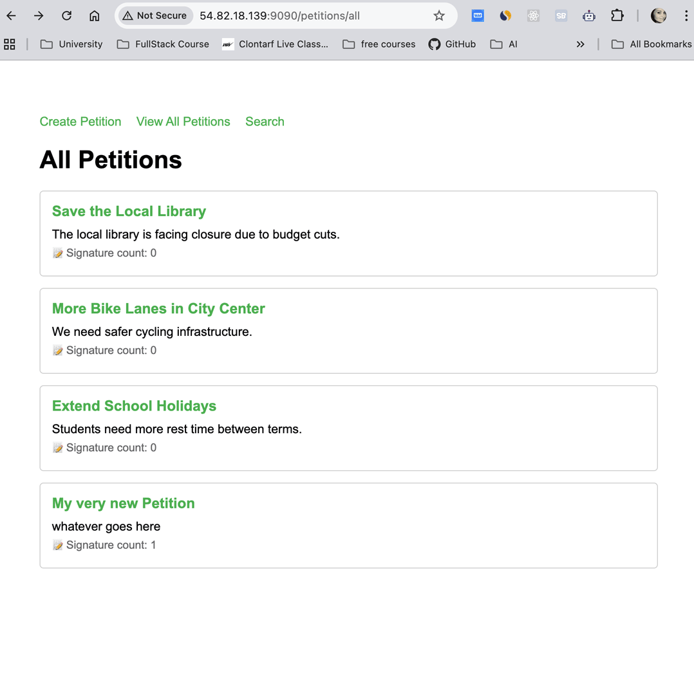
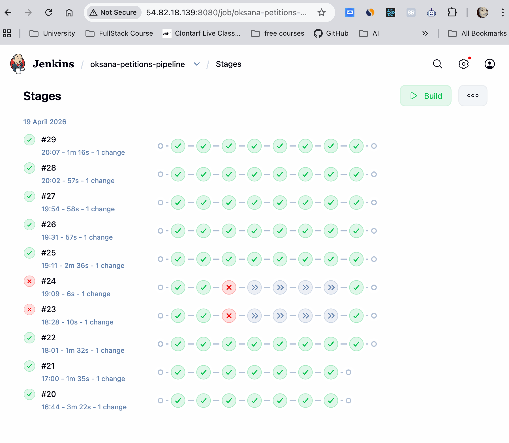
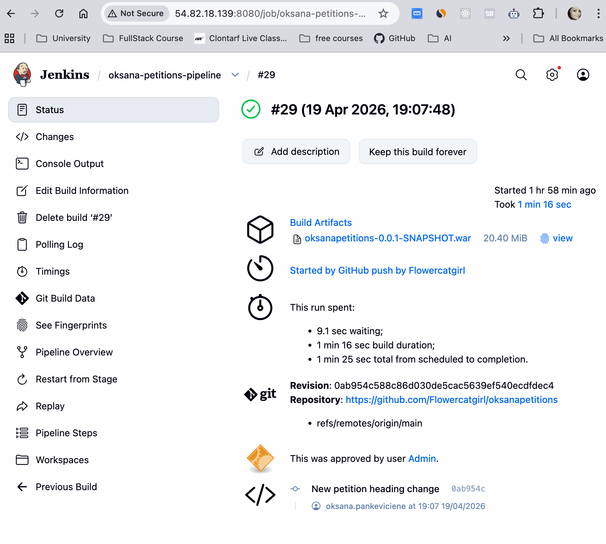
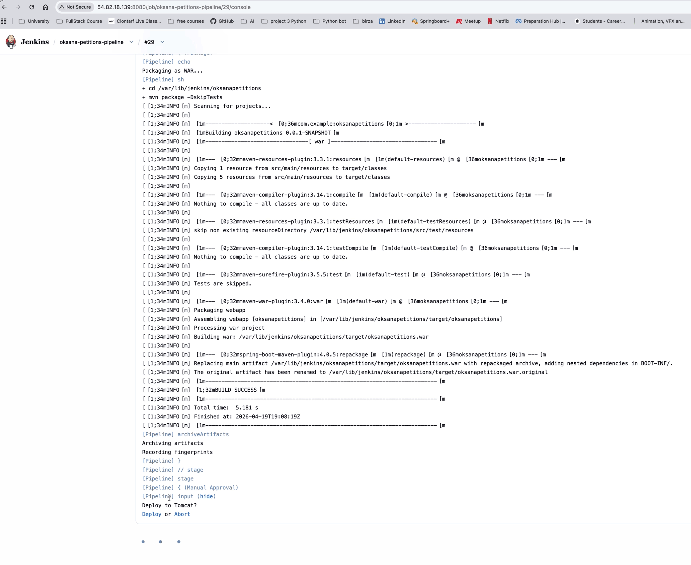
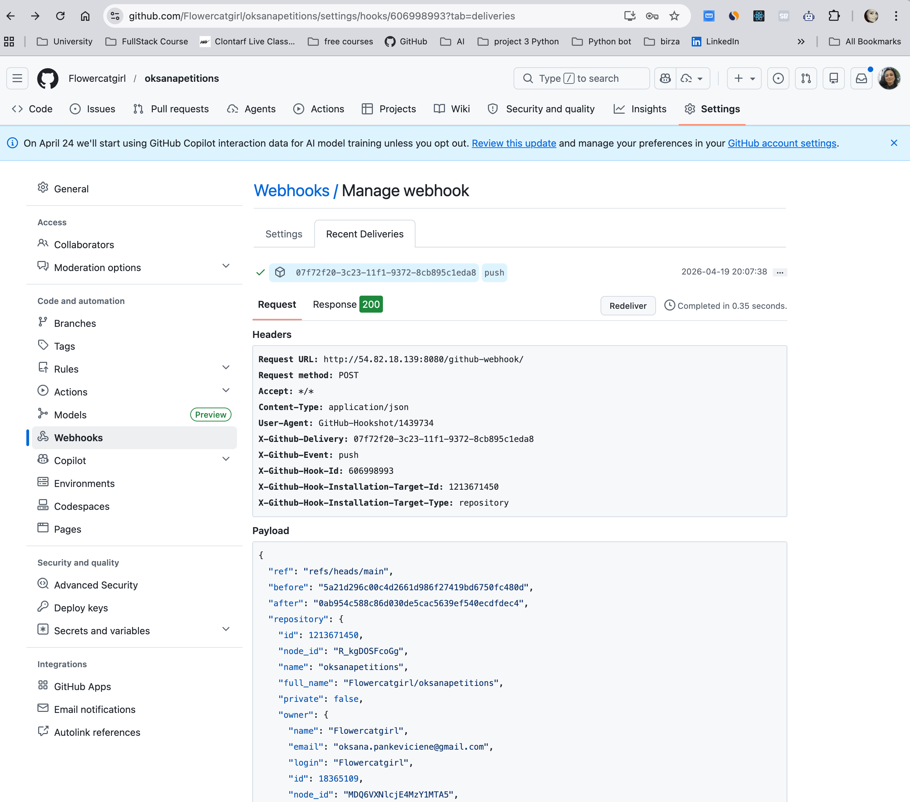
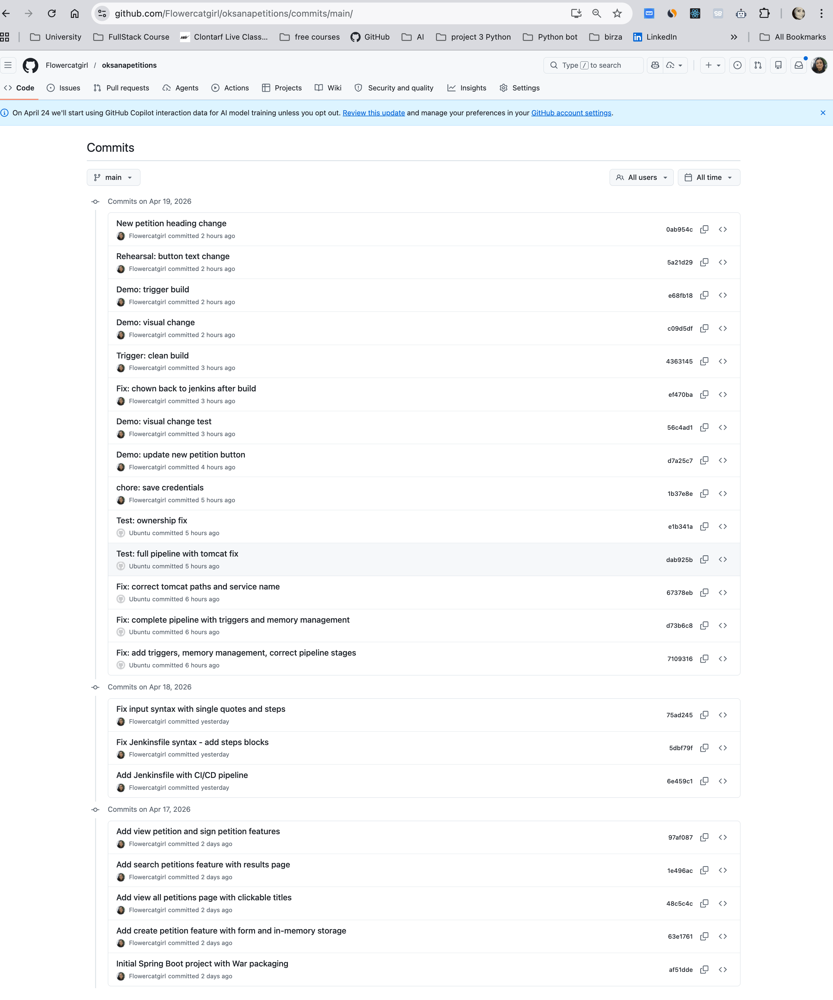

# oksanapetitions — CI/CD Pipeline on AWS EC2

A Spring Boot petitions web application with a complete Jenkins CI/CD pipeline, demonstrating end-to-end DevOps automation on AWS EC2. Every push to `main` triggers an automatic build, test, package, and deploy cycle — with a human approval gate before production.

---

## Architecture

```
                    GitHub
                       │
              push + webhook
                       │
         ┌─────────────▼──────────────────────────────┐
         │         AWS EC2 — t3.micro — Ubuntu 22.04   │
         │                                             │
         │  ┌──────────────────┐   deploy WAR          │
         │  │   Jenkins CI/CD  │──────────────────┐    │
         │  │                  │                  │    │
         │  │  ① Checkout      │    ┌─────────────▼──┐ │
         │  │  ② Build         │    │ Apache Tomcat  │ │
         │  │  ③ Test          │    │ Port 9090      │ │
         │  │  ④ Package WAR   │    │ ROOT context   │ │
         │  │  ⑤ Approval      │    └────────────────┘ │
         │  │  ⑥ Deploy        │                       │
         │  └──────────────────┘                       │
         └─────────────────────────────────────────────┘
                       │
                   port 9090
                       │
               Public access
```

---

## Tech Stack

| Layer | Technology |
|-------|-----------|
| Application | Spring Boot 4, Java 17, Maven, Thymeleaf |
| CI/CD | Jenkins 2.555.1, GitHub Webhooks |
| Application server | Apache Tomcat 10 |
| Infrastructure | AWS EC2 t3.micro, Ubuntu 22.04 |
| Version control | Git, GitHub |

---

## Application Features

The petitions app allows users to create, view, search, and sign petitions — built as a Spring Boot MVC application with Thymeleaf server-side rendering and in-memory storage.

| Page | URL |
|------|-----|
| Create a petition | `/petitions/create` |
| View all petitions | `/petitions/all` |
| Search petitions | `/petitions/search` |
| View and sign a petition | `/petitions/view/{id}` |

---

## CI/CD Pipeline

The pipeline is defined in [`Jenkinsfile`](./Jenkinsfile) at the repository root. A GitHub webhook triggers it automatically on every push to `main`.

| Stage | Command | What it does |
|-------|---------|-------------|
| Checkout | `git pull` | Fetches latest code from GitHub |
| Build | `mvn clean compile` | Compiles all Java source files |
| Test | `mvn test` | Runs the Spring Boot test suite |
| Package | `mvn package` | Produces `oksanapetitions.war`, archived as a build artifact |
| Approval | manual gate | Human confirmation required before production deployment |
| Deploy | `systemctl` + `cp` | Stops Tomcat → copies WAR to webapps/ROOT → restarts Tomcat |

### Automatic triggering

Builds are labelled `Started by GitHub push by Flowercatgirl` in Jenkins, confirming full webhook automation. The `triggers { githubPush() }` declaration in the Jenkinsfile is required for Pipeline jobs using SCM — the Jenkins UI checkbox alone is not sufficient.

---

## Key Engineering Decisions

### Memory management on a 1GB instance

Running Jenkins + Tomcat + Maven simultaneously on a t3.micro (1GB RAM) exhausts available memory. Jenkins alone idles at ~400MB, Tomcat at ~200MB — leaving insufficient space for Maven to launch a new JVM.

**Solution:**
- Capped Jenkins JVM heap in the systemd service file: `-Xms128m -Xmx256m -XX:MaxMetaspaceSize=128m`
- Restructured the Jenkinsfile deploy stage to stop Tomcat before building and restart it only at deploy time, freeing ~200MB exactly when Maven needs it

### Webhook trigger registration

Adding `triggers { githubPush() }` to the Jenkinsfile is necessary but not sufficient. Jenkins must also run one manual build after the declaration is committed — this registers the trigger internally. Without this step, the webhook is received (HTTP 200, `Poked` in logs) but no build starts.

### Tomcat systemd misconfiguration

Tomcat repeatedly failed to start via `systemctl` despite working when launched manually. Root cause: `JAVA_HOME` in the service file pointed to `/usr/lib/jvm/java-17-openjdk-arm64` — a path that does not exist on an amd64 instance running Java 21. Correcting to `/usr/lib/jvm/java-21-openjdk-amd64` resolved all startup failures.

### File ownership in Jenkins builds

Jenkins builds run as the `jenkins` user. Manual git operations run as `ubuntu`. This caused repeated `Permission denied` errors when Maven tried to clean the target directory. Solution: added `ubuntu` to the `jenkins` group, set `setgid` on the repository directory, and added a `post { always }` block to reset ownership to `jenkins` after every build.

---

## Screenshots

### Application — View All Petitions


### Jenkins — Pipeline Build History


### Jenkins — Automatic Trigger Confirmed


### Jenkins — Manual Approval Gate


### GitHub — Webhook Delivery (HTTP 200)


### GitHub — Commit History


---

## What I'd add with more time

- **H2 or PostgreSQL** for persistent petition storage across restarts
- **JUnit unit tests** following Test Driven Development
- **Docker containerisation** for reproducible build environments
- **Elastic IP** so the EC2 public IP does not change on instance restart
- **Blue/Green deployment** to eliminate downtime during updates
- **Slack/email notifications** on build success and failure

---

## Module

CT5209 — Cloud DevOps | University of Galway | April 2026
